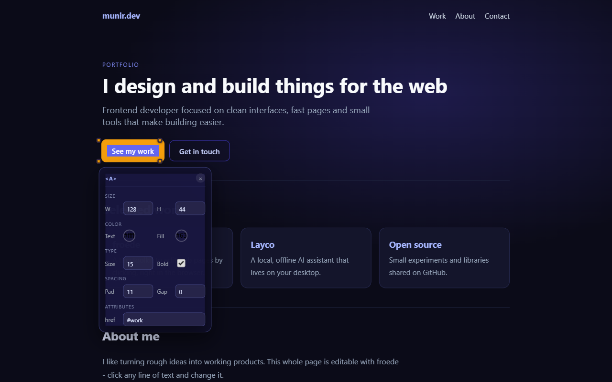
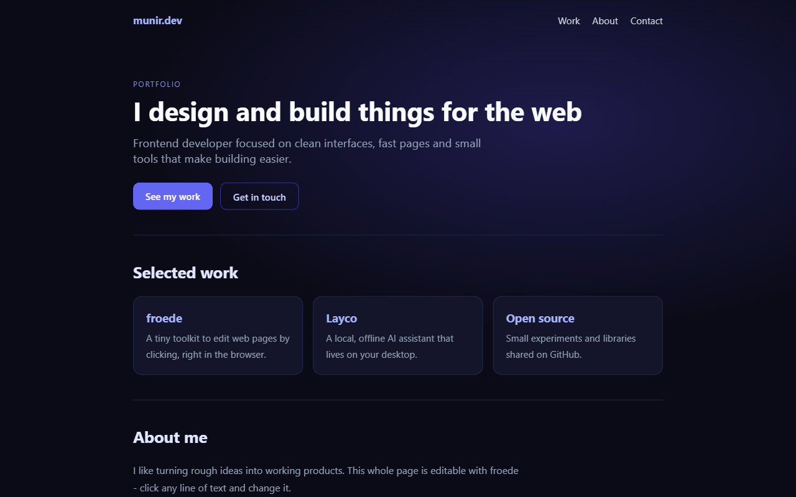
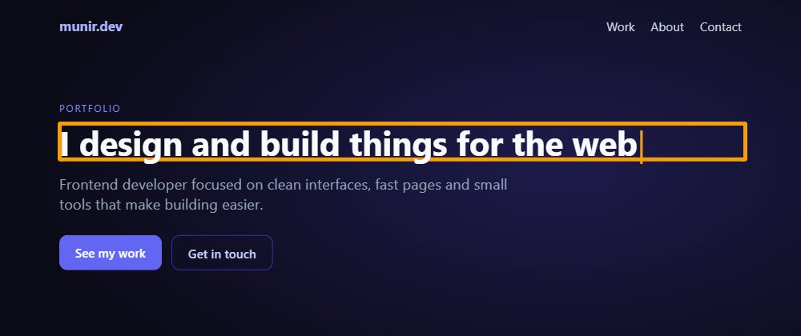
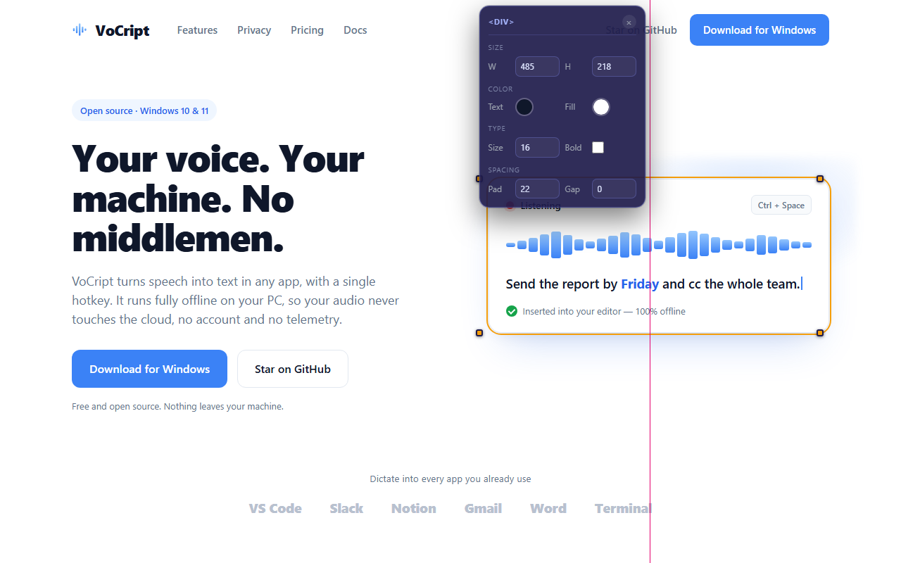

<p align="center">
  <picture>
    <source media="(prefers-color-scheme: dark)" srcset="docs/brand/froede_logoclaro.svg">
    
  </picture>
</p>

# froede

**front + edit + code.** A lightweight toolkit for editing the code behind a running web page or app by clicking on what you see - no diving into the source, no full IDE required.

[](https://www.npmjs.com/package/froede) [](LICENSE)

> **Status: live on npm** (current version in the badge above). Text, size, color, typography, spacing and attributes (alt, href, placeholder, src, title) all edit end to end on both targets (static HTML and React + Vite), verified against real files. You can also **drag elements to move them** (with center-snap guides, like Canva) and **delete them** with Backspace. Full layout tools and animations are still on the roadmap. **In review for the Chrome Web Store** - until it lands there, the quickstart below covers the manual install.



## The idea

Point at an element on a live page or app, change it - text, size, color, typography, spacing, attributes, its position (drag to move) - or delete it, and have that change land in the real source code. Not in a sandbox. Not through an AI agent as a middleman. Not a throwaway DOM tweak that disappears on reload. As simple and intuitive as a devtools extension, not a full design app.

## See it in action

| Before | Editing text | Selected: style + attributes | Moving: center guides |
|---|---|---|---|
|  |  |  |  |

Click any element to select it - resize handles appear on its corners (Shift+drag to lock to one axis) and a panel shows size, color, typography, spacing and the element's editable attributes. Drag it to move it - smart guides snap it to the center of its container - and press Backspace to delete it. Double-click a text element to edit its content in place. Every change writes straight to the real source file.

## Is it safe?

froede edits files on your computer, so this matters: everything runs **locally** (no cloud, no account, no telemetry, no AI), the part that writes files can only touch the one folder you point it at, and every piece is explained in normal words in [SECURITY.md](SECURITY.md) - including what froede can *never* do. Your undo is always `git diff`. The extension's [Privacy Policy](PRIVACY.md) covers exactly what data it does (and does not) touch.

## How it works

```
Browser (Chrome/Edge)                     Your machine
┌────────────────────────┐               ┌─────────────────────────────┐
│ froede extension (MV3) │  WebSocket    │ froede companion (Node.js)  │
│ select/edit an element │ ────────────► │ finds the exact spot in the │
│ text, size, color, ... │  127.0.0.1    │ real source file and splices│
└────────────────────────┘  + token      │ the edit (format preserved) │
                                         └─────────────────────────────┘
                                     static HTML: parse5 splice
                                     React/Vite:  babel loc + Vite HMR
```

- **Static HTML:** the extension sends the element's DOM path; the companion maps it onto the file with parse5 (same WHATWG algorithm as the browser) and splices the text node or the `style="..."` attribute.
- **React + Vite:** a tiny Vite plugin (`vite-plugin-froede`, dev-only) stamps every host element with `data-froede-loc="src/App.tsx:4:6"`; the companion re-parses that file and splices the exact JSX text or patches the `style={{}}` object. Vite HMR shows the change instantly.
- **Style edits are always inline and always scoped to the exact element** - never a shared class rule, so resizing one card never moves its siblings.
- **Security:** loopback only, Origin locked to froede's own extension ID (web pages and other extensions can never connect), shared token (constant-time compared), and the companion physically cannot write outside the project folder it was started in. Every edit verifies the current value first and aborts on mismatch.

## Quickstart

1. **Get the extension** (once per browser): [download the .zip from the latest release](https://github.com/Mun1to/froede/releases/latest), unzip it, then go to `chrome://extensions`, turn on Developer mode, click "Load unpacked" and pick the unzipped folder.

2. **Wire up your project** (static HTML projects skip this - just serve the folder on localhost):

   ```bash
   cd your-project
   npx froede init   # detects your Vite config, installs the plugin, wires it up
   ```

3. **Start the companion and pair it:**

   ```bash
   npx froede        # prints a port and a pairing token
   ```

   Open your localhost page, paste the port + token into the extension popup, and hit "Toggle edit mode". Click to select, double-click to edit text - every change is saved to the real file, and your undo is `git diff`.

   > Loaded unpacked? Chrome gives the extension a per-folder ID that the companion has to trust. Copy the ID shown under the extension in `chrome://extensions` and start the companion with it: `FROEDE_EXTENSION_ID=<that-id> npx froede` (PowerShell: `$env:FROEDE_EXTENSION_ID="<that-id>"; npx froede`). Once froede is installed from the Chrome Web Store this isn't needed - its ID is trusted by default.

Full walkthrough, including a ready-to-paste prompt for your AI coding session: [`docs/INSTALAR.md`](docs/INSTALAR.md) (Spanish).

v0.4 edits plain visible text, inline size/color/typography/spacing, and a safe allowlist of attributes (href/src reject script-scheme URLs), and adds layout basics - drag to move (with center-snap guides) and delete. Duplicating elements and animations are still on the roadmap.

## With Claude Code (or any AI assistant)

froede ships a [Claude Code](https://claude.com/claude-code) skill that spins it up for you: it detects static HTML vs React/Vite, starts the companion, and walks you through pairing and editing. Copy [`.claude/skills/froede/`](.claude/skills/froede/SKILL.md) into your own `~/.claude/skills/`, then just say *"start froede here"* in any project.

No skill? Paste this into your AI session:

> Set up froede (github.com/Mun1to/froede) to edit my localhost page by clicking. Detect static HTML vs React/Vite (run `npx froede init` once if Vite), start the companion with `npx froede`, give me the port and token for the extension popup, and guide me to edit: click to select, double-click for text, drag to move, Backspace to delete; undo with `git diff`.

## Landscape (as of mid-2026)

Before starting, we looked for anything that already does this:

| Project | Open source | Simple / lightweight | Writes back to real source |
|---|---|---|---|
| [Onlook](https://github.com/onlook-dev/onlook) | Yes (Apache-2.0) | No - full editor app, sandboxed web container, Next.js + Tailwind only | Yes |
| [Stagewise](https://github.com/stagewise-io/stagewise) | Yes | Yes - browser toolbar | Indirect - routes through a connected AI coding agent |
| [VisBug](https://github.com/GoogleChromeLabs/ProjectVisBug) | Yes (Apache-2.0) | Yes - browser extension | No - ephemeral, DOM-only |
| [GrapesJS](https://github.com/GrapesJS/grapesjs) | Yes (BSD-3-Clause) | No - an SDK for building editors, not an end-user tool | No - export-based |
| [Plasmic](https://github.com/plasmicapp/plasmic) | Split (MIT core / AGPL studio) | No - separate Studio app | Publish-based, not live |
| Chrome DevTools Workspaces | Built-in | Yes | Sources panel only - element/DOM edits aren't saved |

None of them combine "point-and-click simple" with "writes straight to your real source, no sandbox, no AI middleman." That's the gap froede is aiming at.

Full research notes: [`docs/INVESTIGACION.md`](docs/INVESTIGACION.md) (Spanish).

## License

MIT - see [LICENSE](LICENSE).
